# 🎬 Netflix Content Analysis

This project explores the storytelling heartbeat behind Netflix’s global catalog—uncovering trends in content growth, genres, runtimes, and the emotional themes woven into descriptions.

---

## 🔍 Key Highlights

### 1. 📈 Content Boom Post-2016  
Netflix's catalog surged after 2016, peaking around 2019. Movies make up about **70%** of titles, while TV shows account for the rest.

  
  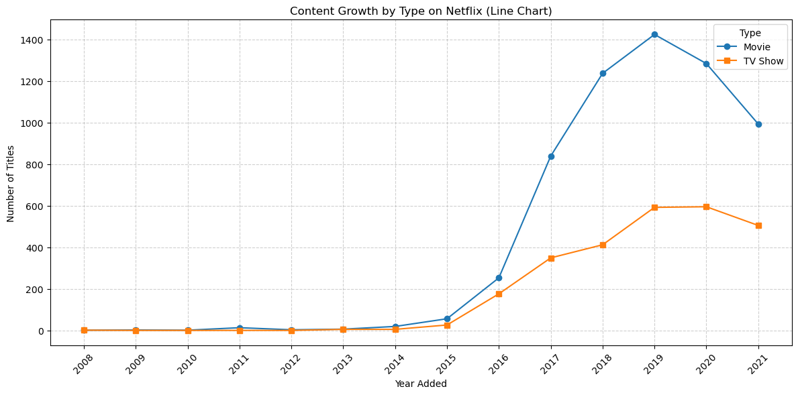

---

### 2. 🌍 Centers of Creation  
- **USA** leads by a wide margin, followed by **India** and the **UK**.  
- **Thai content** spiked in 2018, mostly as international movies and dramas.

  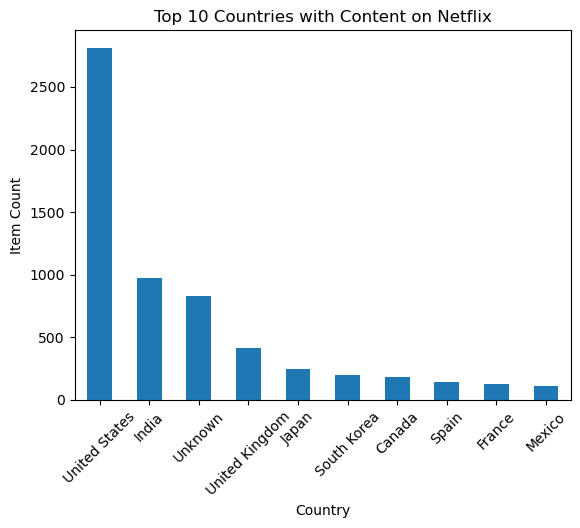
  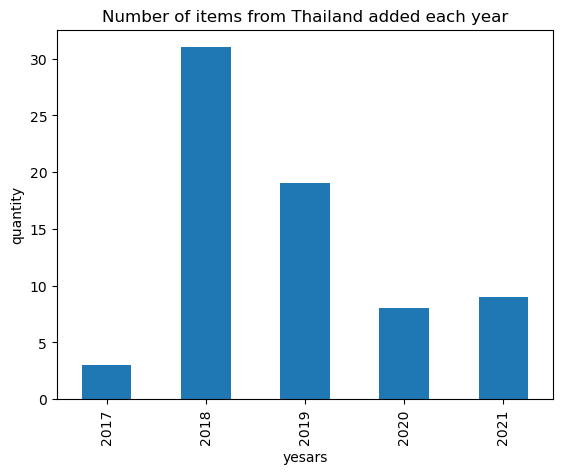
  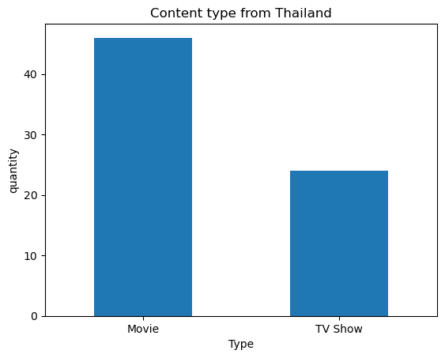

---

### 3. ⏱️ How We Watch  
- Movies cluster between **80–100 minutes**—classic feature length.  
- Over **60% of TV shows** run just **1 season**, hinting at a preference for shorter series.

  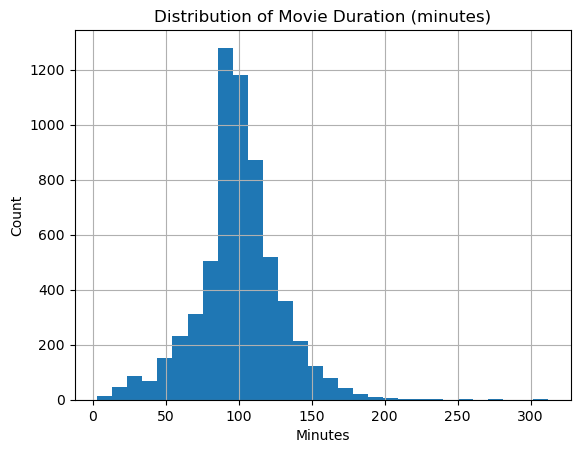
  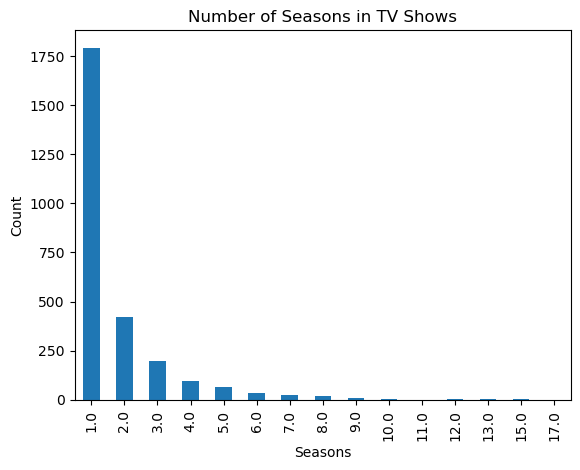

---

### 4. 🎭 Genre Focus  
Netflix features a rich mix of **international titles**, especially:  
- **Movies**: International Movies, Dramas, Comedies  
- **TV Shows**: International TV Shows, Dramas, Crime series  

  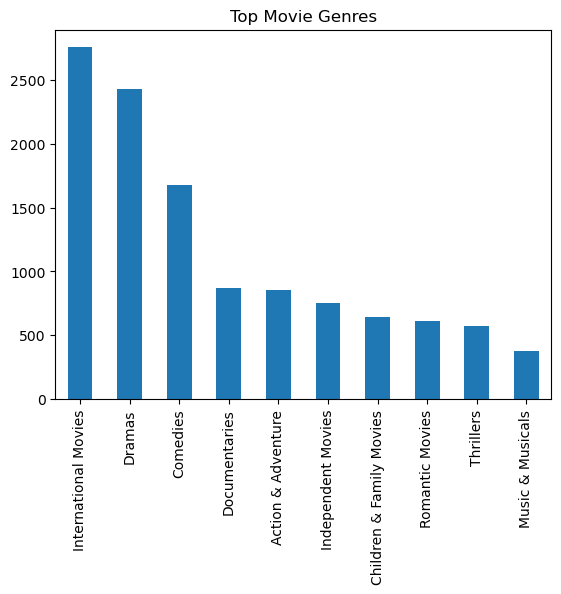
  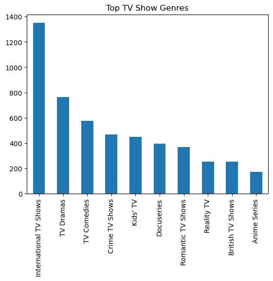

---

### 5. 🔞 Mature Content  
**TV-MA** is the dominant rating, revealing a strong orientation toward adult audiences. Movies carry more **R** and **PG-13** content than their TV counterparts.

  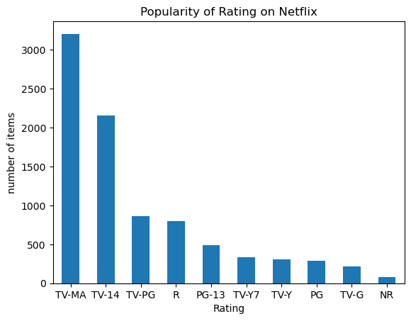
  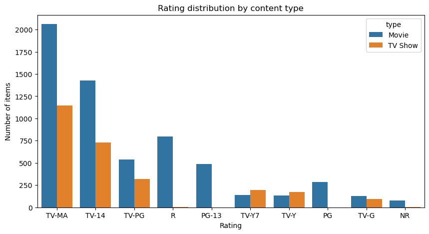

---

### 6. 🧠 Story Themes  
Netflix content consistently leans into **emotional, human-centered storytelling**.  
Keywords extracted from thousands of show descriptions reveal a strong presence of words such as:

- **life** (2.19%)  
- **young** (1.94%)  
- **new** (1.90%)  
- **family** (1.77%)  
- **world** (1.68%)  
- **man** (1.57%)  

These frequent terms point to recurring themes of **personal growth**, **relationships**, and **identity**, often exploring the **challenges of youth**, the **complexity of love**, and the **connections that define us**.

  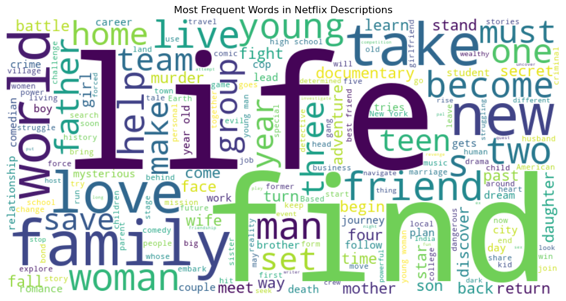

---

## 🛠 Tools & Data  
- Python: `pandas`, `matplotlib`, `seaborn`, `wordcloud`  
- Jupyter Notebook  
- Source: Netflix Titles Dataset from [Kaggle](https://www.kaggle.com/datasets/shivamb/netflix-shows)

---

## 👤 About Me  
**Pakawat Raskasin**  
Master’s in Data Science | Passionate about media insights & data narratives  
🔗 [LinkedIn](https://www.linkedin.com/in/pakawat-raskasin/) | [GitHub](https://github.com/Taralimz)
